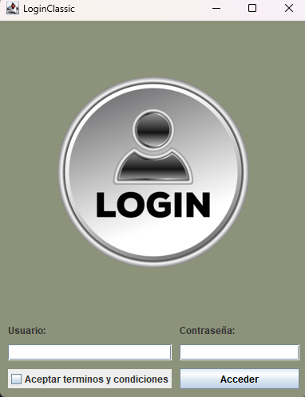
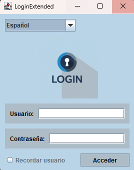
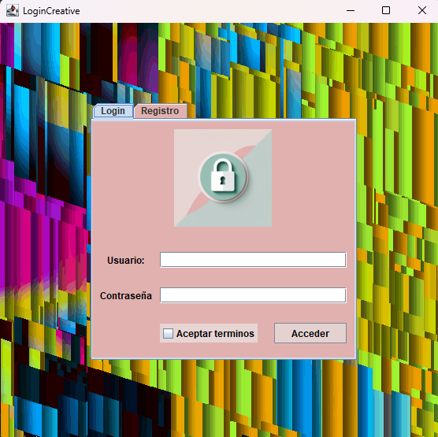

# 🔐 Interfaz de Login en IntelliJ (sin eventos)

Este proyecto presenta **3 diseños diferentes** de una interfaz de inicio de sesión creados con **IntelliJ GUI Designer**, explorando el uso de componentes, propiedades y estilos.

---

## 📸 Diseños

### 🟦 Versión 1 – Clásica
✅ Interfaz básica con:
- Usuario y Contraseña  
- Checkbox “Aceptar términos y condiciones”  
- Botón “Acceder”  

---

### 🟨 Versión 2 – Extendida
✨ Añade:
- JComboBox (idioma)  
- JRadioButton (recordar usuario)  
- JPanel para mejor organización  

---

### 🟪 Versión 3 – Creativa
🎨 Incluye elementos poco comunes:
- JTabbedPane (Login / Registro)  
- JProgressBar (carga ficticia)  
- JSpinner (edad)  
- JSlider (nivel de seguridad)  

---

## ⚙️ Propiedades demostradas
- **Texto** → `setText`, `setFont`  
- **Colores** → `setForeground`, `setBackground`  
- **Iconos** → `setIcon` en JLabel y JButton  
- **Alineación** → `setHorizontalAlignment`  
- **Tooltips** → `setToolTipText`  
- **Visibilidad/Edición** → `setEnabled`, `setEditable`  

---

## 📂 Estructura del proyecto
